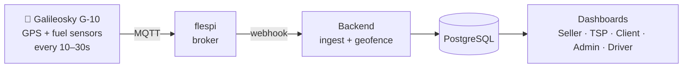
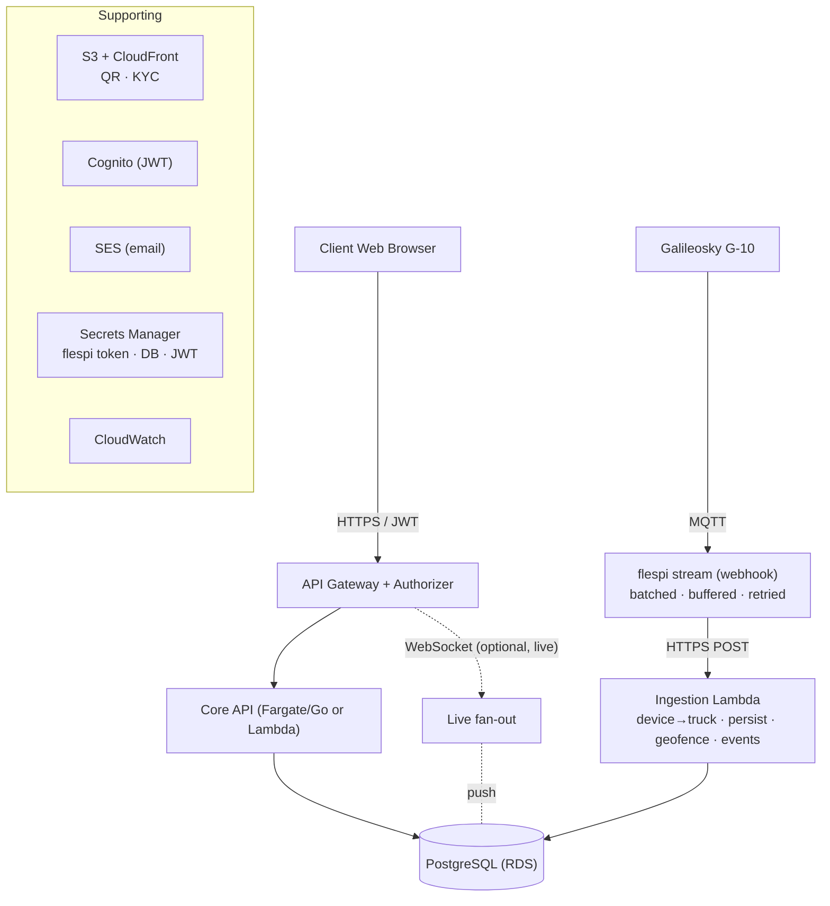
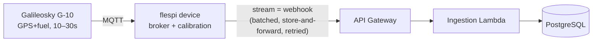
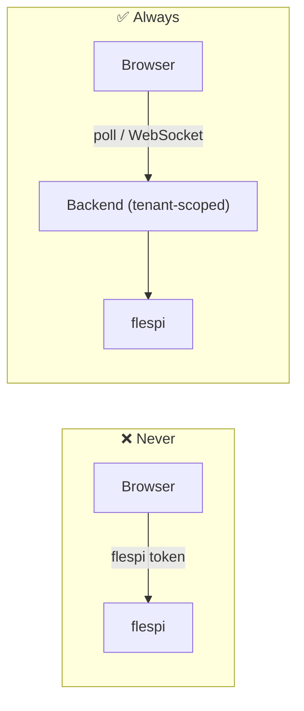
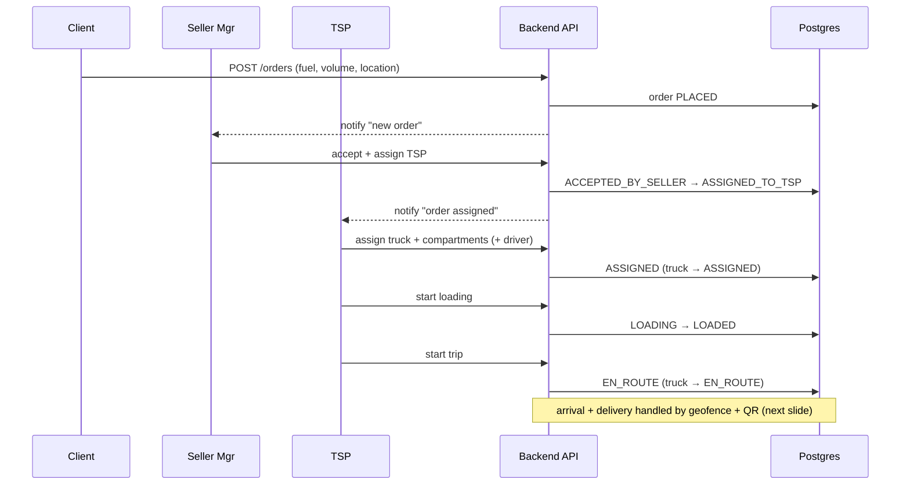
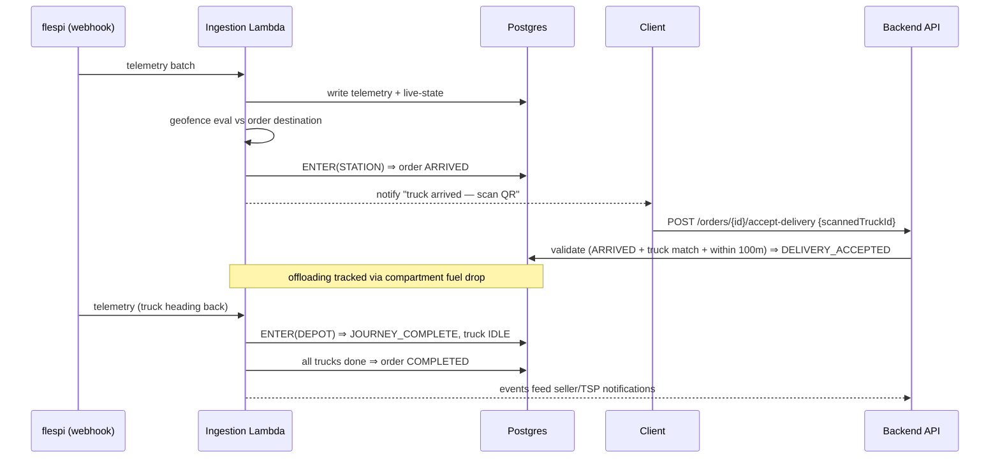
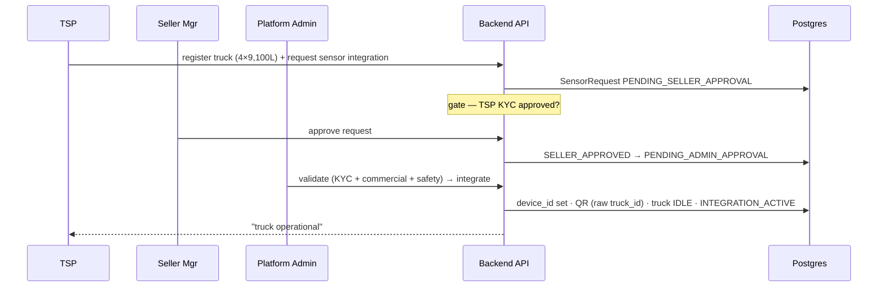
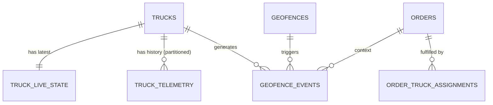

# Backend Architecture — Slide Outline & Sequence Diagrams

A presentation companion to [BACKEND_ARCHITECTURE.md](BACKEND_ARCHITECTURE.md) and
[LOCATION_GEOFENCE_SERVICE.md](LOCATION_GEOFENCE_SERVICE.md). One block ≈ one slide.
Diagrams use Mermaid (renders on GitHub/most Markdown previewers); ASCII fallbacks included where useful.

---

## Slide 1 — Title

**Fuel Ordering & Monitoring Platform — Backend Architecture**
Telemetry ingestion · Geofencing · Order lifecycle · AWS, cost-optimized
*Baseline: the dashboard as-built (post-refactor) is canonical.*

---

## Slide 2 — The Problem in One Picture

Trucks carry **Galileosky G-10** sensors → publish via **flespi** → backend must
**persist location**, **detect arrival/return** (geofence), and **drive the order
lifecycle**, while showing it all on tenant-scoped dashboards.



---

## Slide 3 — Five Decisions That Shape Everything

1. **flespi is the broker — no AWS IoT Core.**
2. **One ingestion path**, location + geofence as internal modules.
3. **Browser never talks to flespi** — all live data via backend (tenant-scoped).
4. **Latest-state separated from partitioned history.**
5. **Plain RDS Postgres over Aurora Serverless** at this scale.

> Result: **~$40–70/mo** vs the original proposal's **$240–340/mo**.

---

## Slide 4 — As-Designed vs As-Built

The original proposal predates the dashboard. Backend follows the **dashboard** where they differ.

| Concern | Proposal (older) | Dashboard (canonical) |
|---|---|---|
| TSP onboarding | Email invite + token | Seller-code + connection request |
| Sensor integration | 1-step | 2-step (Seller → Admin) |
| Compartments | Arbitrary capacity | Fixed 4 × 9,100 L |
| QR payload | `{truck_id, workspace_id}` | Raw `truck_id` |
| Roles | + `CLIENT_VIEWER` | + `DRIVER` |
| Tenancy (MVP) | many workspaces | single `ws-anptco` (scales out) |

---

## Slide 5 — High-Level Architecture



---

## Slide 6 — Telemetry Ingestion Path



**Lambda, per message, in order:**
`device→truck (cached)` → `write telemetry` → `upsert live-state (if newer)` →
`geofence eval` → `emit ENTER/EXIT` → `advance order` → *(optional)* `push live`.

---

## Slide 7 — Why Webhook, Not a Persistent MQTT Container (MVP)

| | Webhook → Lambda | MQTT container |
|---|---|---|
| Reliability | **Store-and-forward, replays on failure** | Loses messages while down (unless QoS+sessions) |
| Cost | ~$0 (batched invocations) | ~$15–30/mo always-on |
| Live push | Lambda → API GW WebSocket | Native, but… |
| Latency edge | n/a | **Wasted — device only reports every 10–30s** |

> The truck emits every 10–30s, so sub-second transport latency changes nothing the user can see. Webhook wins on reliability **and** cost. Revisit a container at **hundreds of trucks**.

---

## Slide 8 — Live Tracking (the one hard rule)

**The browser never subscribes to flespi directly.** It would leak the flespi token,
bypass tenant isolation (a client could watch every truck), and hit flespi limits.



**Durability vs liveness:** webhook→Lambda is the **source of truth**; any live/WS path is **best-effort and disposable**.

---

## Slide 9 — Geofencing (dynamic, stateful, event-driven)

Geofences that matter are **dynamic**: the active order's **destination** + the **depot**.
Evaluated in backend code (Haversine), **not** flespi static geofences.

```
last_state = INSIDE | OUTSIDE   (per truck, per geofence)

reading:
  inside_now = haversine(reading, geofence) <= radius
  OUTSIDE→INSIDE  ⇒ emit ENTER
  INSIDE→OUTSIDE  ⇒ emit EXIT
  else            ⇒ no event        (gate on device timestamp)
```

- destination **< 100m** ⇒ order `ARRIVED`
- depot **< 200m** after delivery ⇒ `JOURNEY_COMPLETE` → truck `IDLE` → order `COMPLETED`

---

## Slide 10 — Sequence: Order Lifecycle (place → delivered)



---

## Slide 11 — Sequence: Geofence-Driven Delivery & Return



---

## Slide 12 — Sequence: Sensor Integration (2-step, canonical)



---

## Slide 13 — Data Model Highlights



- `truck_live_state` → **O(1) "where now"**
- `truck_telemetry` → **partition monthly, retain 30–90d**
- `geofences` (DEPOT/STATION) + `geofence_events` (ENTER/EXIT) → drive workflow

---

## Slide 14 — Multi-Tenancy & Security

- **DB:** every table has `workspace_id`; Postgres **RLS** via `SET app.workspace_id`.
- **App:** JWT (Cognito) carries `workspace_id` + `roles`; URL `workspaceId` validated.
- **Roles:** `PLATFORM_ADMIN`, `SELLER_MANAGER`, `TRANSPORT_ADMIN`, `CLIENT`, `DRIVER`.
- **Secrets:** flespi token, DB creds, JWT key in **Secrets Manager** — never in browser.
- **Encryption:** RDS/KMS at rest, TLS in transit; KYC = private + signed URLs, QR = CloudFront.

---

## Slide 15 — AWS Deployment & Cost

| Component | Choice | Why |
|---|---|---|
| Ingestion | flespi webhook → API GW → Lambda | cheap, buffered, no always-on |
| Broker | flespi only (no IoT Core) | already the broker |
| API | Fargate (Go) or Lambda | start simple |
| DB | RDS `db.t4g.micro/small` | Aurora floor wasteful here |
| Live | poll → WebSocket later | device cadence makes push moot |
| Storage/Auth/Email | S3+CloudFront / Cognito / SES | standard |

**~$40–70/mo now.** Crossover to a **batching container consumer** at **hundreds of trucks**.

---

## Slide 16 — Open Items (honest unknowns)

- **flespi webhook retry/buffer guarantees** — confirm against current flespi docs *(linchpin of the reliability story)*.
- **Calibration location** — flespi calculators **or** in-Lambda (`fuel_sensors.calibration_table`) — pick one, don't double-apply.
- **Telemetry retention window** — 30 / 60 / 90 days + downsample target.
- **Live-tracking upgrade trigger** — threshold to add WebSocket over polling.

---

## Slide 17 — Summary

- Dashboard flow is canonical; backend reconciles to it.
- **One durable, buffered ingestion path**; geofence events replace simulated timers.
- **Browser → backend → flespi**, never browser → flespi.
- **Cheapest correct AWS shape now**, with clear, pre-identified scale-out triggers.
